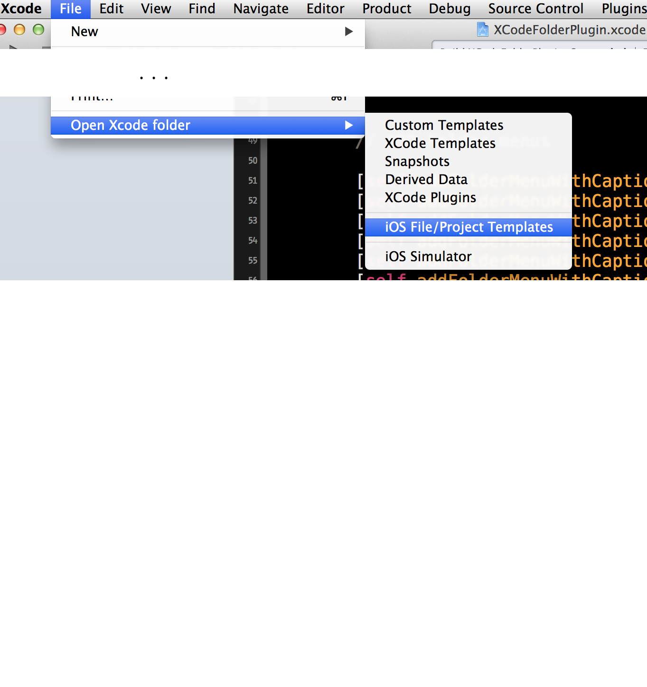

XCodeFolderPlugin
=================

Xcode plugin to open most important folders in finder

Just download or clone the plugin and run it in Xcode. Then close and restart Xcode and you´ll find an new menu item in the file menu "Open Xcode folder"

If you need some other folders, just open XCodeFolderPlugin.m and look for the lines

        // ADD Folder menus
        
        [self addFolderMenuWithCaption:@"Custom Templates" andPath:@"~/Library/Developer/Xcode/Templates/"];
        [self addFolderMenuWithCaption:@"Snapshots" andPath:@"~/Library/Developer/Xcode/Snapshots/"];
        
In the same manner you add new path menu items ...

You just have to re-run the plugin and then restart Xcode. That´s all ;-)

Any comments welcome ...
